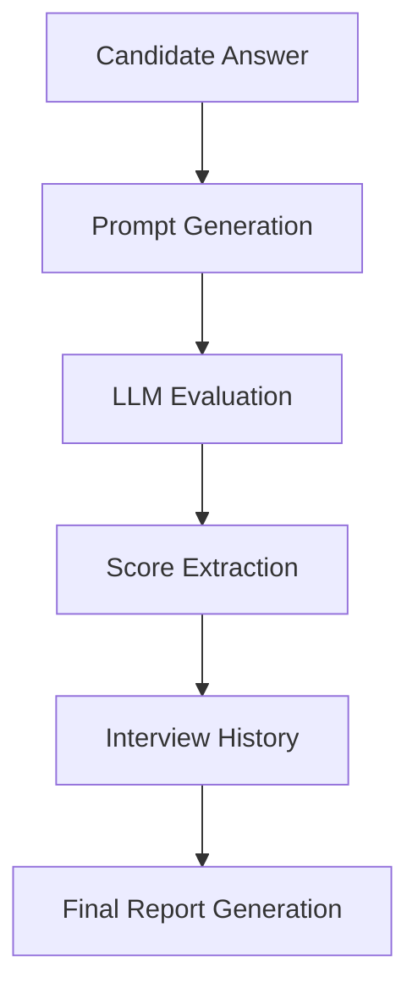

# 🤖 SmartHire AI Agent

> AI-powered mock interview system built using Python and Large Language Models (LLMs) for intelligent interview evaluation, scoring, feedback generation, and final performance analysis.

---

## 📌 Overview

**SmartHire AI Agent** is an AI-driven mock interview platform designed to simulate real-world technical interviews.

The system evaluates candidate answers using LLMs, generates intelligent feedback, extracts interview scores automatically, tracks interview history, and produces detailed performance reports.

This project demonstrates practical implementation of:

* Prompt Engineering
* LLM Integration
* AI-based Evaluation Systems
* Python OOP Architecture
* Automated Feedback Generation
* Interview Analytics
* Report Generation

---

## ✨ Features

### ✅ AI-Powered Interview Evaluation

* Evaluates candidate answers using LLMs
* Generates intelligent technical feedback
* Detects missing concepts
* Suggests improved answers
* Provides interview improvement suggestions

### ✅ Automatic Score Extraction

* Extracts interview scores automatically from LLM responses
* Calculates total and average scores
* Performs overall performance analysis

### ✅ Interview History Tracking

Stores:

* Topic
* Question
* Candidate Answer
* LLM Evaluation
* Extracted Score

### ✅ Final Interview Report Generation

* Detailed question-wise analysis
* Performance summary
* Technical feedback
* Improvement recommendations

### ✅ Clean OOP Architecture

* Modular design
* Reusable classes
* Easy scalability
* Production-style structure

---

## 🧠 Core Concepts Used

| Category             | Concepts                           |
| -------------------- | ---------------------------------- |
| AI/LLM               | Prompt Engineering, LLM Evaluation |
| Python               | OOP, Classes, Exception Handling   |
| NLP                  | Text Processing, Evaluation Logic  |
| Software Engineering | Modular Design, Reporting Systems  |

---

## 📂 Project Structure

```bash
SmartHire-AI-Agent/
│
├── interview_agent.py      # Core AI interview agent
├── llm_engine.py           # LLM communication module
├── main.py                 # Main execution file
├── requirements.txt        # Dependencies
├── .gitignore              # Ignored files
└── README.md               # Project documentation
```

---

## ⚙️ Workflow



---

## 🔍 How It Works

### 1️⃣ Candidate Provides Answer

The user enters:

* Topic
* Interview Question
* Candidate Answer

---

### 2️⃣ Prompt Engineering

The system generates a structured prompt for the LLM.

```python
prompt = f"""
You are an expert technical interviewer.
Evaluate the student's answer carefully.
"""
```

---

### 3️⃣ LLM Evaluation

The answer is sent to the LLM for:

* Technical analysis
* Score generation
* Missing concepts detection
* Improvement suggestions

---

### 4️⃣ Score Extraction

The system automatically extracts numerical scores from the LLM response.

---

### 5️⃣ Final Report Generation

A detailed interview performance report is generated.

---

## 🖥️ Example Output

```text
================================================
Generating Final Interview Report...
================================================

Student Name : Rushabh

Total Questions Asked : 5
Total Score           : 38
Average Score         : 7.6/10

Overall Performance:
Good performance.
Student should add more examples and technical depth.
```

---

## 🧩 Main Class

# `MockInterviewAgent`

This class is responsible for:

* Answer evaluation
* Score extraction
* Interview history management
* Performance analysis
* Final report generation

---

## 🔧 Key Methods

| Method                    | Description                                 |
| ------------------------- | ------------------------------------------- |
| `evaluate_answer()`       | Sends answer to LLM and receives evaluation |
| `extract_score()`         | Extracts numerical score from evaluation    |
| `generate_final_report()` | Generates complete interview report         |

---

## 📌 Technologies Used

| Technology         | Purpose                 |
| ------------------ | ----------------------- |
| Python             | Core Development        |
| LLMs               | AI Evaluation           |
| Prompt Engineering | Structured AI Responses |
| OOP                | System Architecture     |
| NLP Concepts       | Text Analysis           |

---

# 🚀 Installation

## 1️⃣ Clone Repository

```bash
git clone https://github.com/your-username/SmartHire-AI-Agent.git
```

---

## 2️⃣ Navigate to Project Directory

```bash
cd SmartHire-AI-Agent
```

---

## 3️⃣ Install Dependencies

```bash
pip install -r requirements.txt
```

---

## 4️⃣ Run Project

```bash
python main.py
```

---

# 📖 Sample Usage

```python
from interview_agent import MockInterviewAgent

agent = MockInterviewAgent("Rushabh")

result = agent.evaluate_answer(
    topic="Python",
    question="What is polymorphism?",
    answer="Polymorphism allows methods to behave differently."
)

print(result)

report = agent.generate_final_report()
print(report)
```

---

# 📊 Example Evaluation Format

```text
Score: 8/10

Evaluation:
The answer is partially correct.

Missing Points:
Method overriding and runtime polymorphism.

Improved Answer:
Polymorphism allows methods to behave differently based on objects.

Interview Suggestion:
Add real-world examples while answering.
```

---

# 🎯 Future Improvements

* 🎤 Voice-based interview system
* 🧠 Resume-based question generation
* 🌐 Streamlit Web UI
* 🗄️ Database integration
* 📈 Analytics dashboard
* 🎥 Real-time speech analysis
* 😊 Emotion detection
* 💻 AI-generated coding interviews
* 📚 RAG-based technical interviews

---

# 🏗️ GitHub Repository Setup Guide

## Step 1: Create New Repository

Go to:

👉 [https://github.com/new](https://github.com/new)

Repository Name:

```text
SmartHire-AI-Agent
```

Choose:

* Public or Private
* Add README later

Click:

```text
Create Repository
```

---

## Step 2: Initialize Git

```bash
git init
```

---

## Step 3: Add Files

```bash
git add .
```

---

## Step 4: Commit Code

```bash
git commit -m "Initial commit - SmartHire AI Agent"
```

---

## Step 5: Connect GitHub Repository

```bash
git remote add origin https://github.com/your-username/SmartHire-AI-Agent.git
```

---

## Step 6: Push Code to GitHub

```bash
git branch -M main
git push -u origin main
```

---

# 📝 Suggested `.gitignore`

```gitignore
__pycache__/
*.pyc
.env
venv/
.idea/
.vscode/
```

---

# 🏆 Resume Project Description

## 🔹 Short Version

Developed an AI-powered mock interview agent using Python and LLMs for automated technical interview evaluation, intelligent feedback generation, score extraction, and performance analytics.

---

## 🔹 Advanced Resume Version

Architected and developed an AI-driven mock interview platform leveraging LLM-based evaluation pipelines, prompt engineering, automated scoring systems, and interview performance analytics for intelligent candidate assessment and feedback generation.

---

# 📸 Suggested GitHub Screenshots

Add screenshots of:

* Terminal execution
* LLM evaluation output
* Final report output
* Project architecture diagram
* Folder structure

---

# 🌟 Why This Project Is Strong

This project demonstrates:

* Real-world AI application development
* Prompt engineering skills
* LLM workflow design
* Python software engineering
* AI automation thinking
* Interview analytics system design

Excellent for:

* AI/ML Engineer roles
* Generative AI Engineer roles
* Python Developer roles
* Applied AI positions

---

# 👨‍💻 Author

## Rushabh Balasaheb Kalukhe

AI/ML Engineer • Generative AI Enthusiast • Python Developer

---

# 📜 License

This project is licensed under the **MIT License**.

---

# ⭐ Support

If you found this project useful:

* Give it a ⭐ on GitHub
* Share it with others
* Contribute to improve it

AI Interview Automation
String Processing
Report Generation
